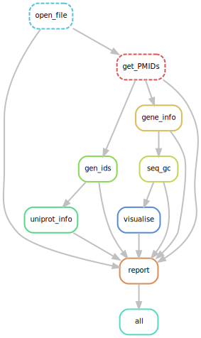

# Snakemake Workflow - Course 11

A Snakemake workflow to get gene and protein information for different locus tags. This workflow produces a html report which displays different gene ID's, the gene description, the GC percentage and the sequence of the different genes.

## Getting Started

These instructions will get you a copy of the project up and running on your local machine for development and testing purposes. See deployment for notes on how to deploy the project on a live system.

### Prerequisites

To run this workflow, this software needs to be installed:

#### Vagrant 

If you don't use got Linux or MacOS X, you can setup a Linux virtual machine with Vagrant.</br>
To install Vagrant: </br>
```
> vagrant init hashicorp/precise64
> vagrant up
```

#### Miniconda 3

Install Miniconda 3
```
$ wget https://repo.continuum.io/miniconda/Miniconda3-latest-Linux-x86_64.sh
$ bash Miniconda3-latest-Linux-x86_64.sh
```

### Installing

After installing Miniconda 3 this git repository needs to be cloned.

```
$ git clone https://github.com/ALuesink/Workflow_Course11.git
```

Create a snakemake environment:

```
$ conda env create --name {name-environment} --file environment.yaml
```

#### Activating Snakemake environment

```
$ source activate {name-environment}
```
#### Deactivating Snakemake environment
```
$ source deactivate
``` 


## Running the workflow

To run the workflow:
```
$ snakemake report.html
```

The workflow exists of 8 rules. Below an overview of the workflow is shown. 



The rule open_file opens a text file to retrieve all the locus tags

|Rule|Description|
|---|---|
|open_file|opens a text file to retrieve all the locus tags|
|get_PMIDs|uses Biopython to retrieve PMIDs for the locus tags|
|gene_info|gets gene info from NCBI
|seq_gc|gets the sequence and GC percentage of the gene|
|visualise|visualizes the GC percentage in a barplot|
|gen_ids|retrieves IDs of different databases of the genes|
|uniprot_info|gets Uniprot info of the genes|
|report|combines gene information in a html report|
|all|runs all rules|
|
|

